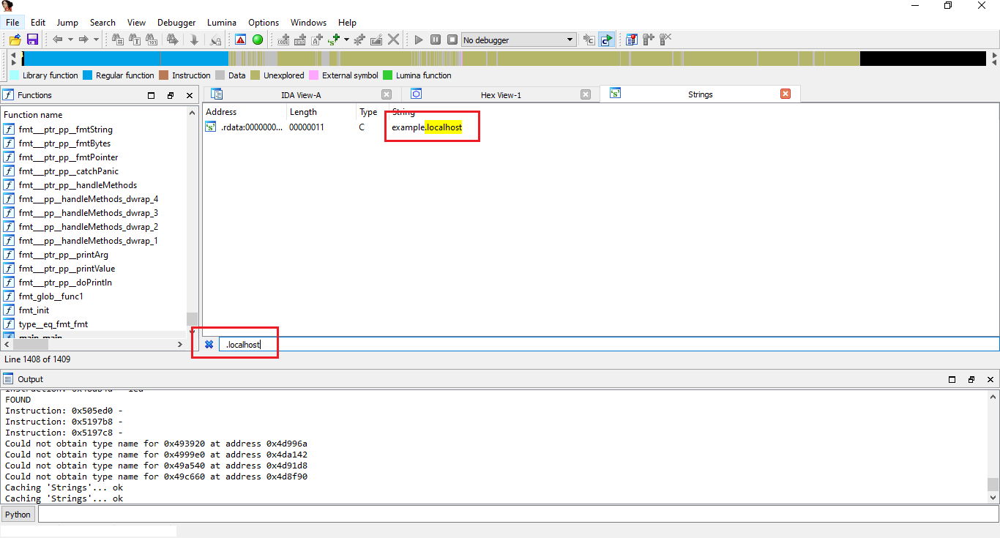
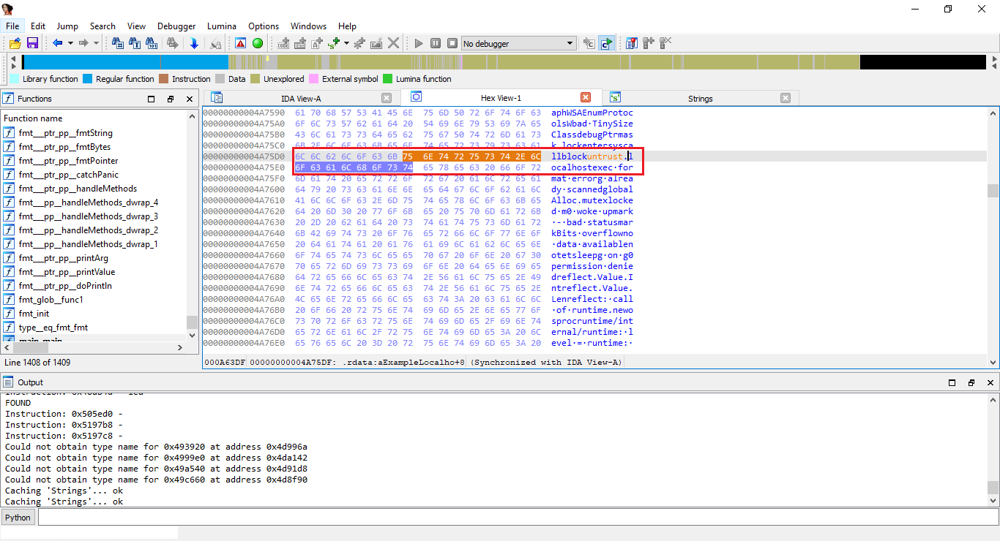
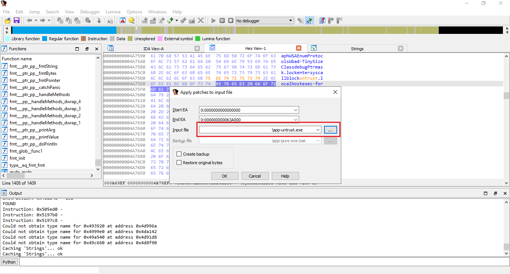
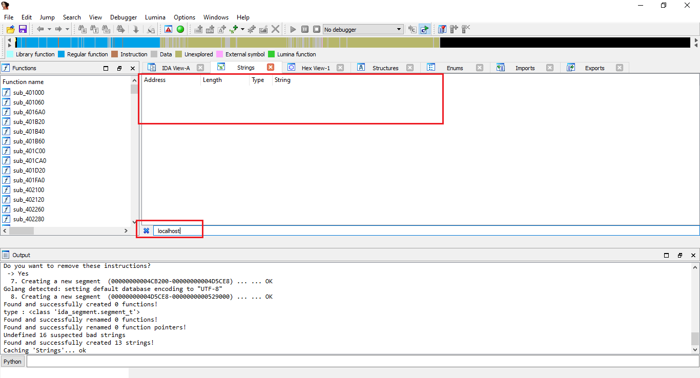

# Obfuscation Experiment
This project is an experiment in obfuscating a simple application written in Golang.

Code obfuscation for software security, Emin Muhammadi: [paper.pdf](docs/paper.pdf)

## Scenario
Software Development Company releases a paid-software. This software should be accessed by only and only if user
has a valid license key. When app starts, it should ask user to enter license key. If user enters valid license key,
then app should show user's details and it starts to work.

License key is a string of characters. This license key should be verified by software company. Basically, app sends a request 
to example.localhost/verify API endpoint with license key as a query parameter. What if someone tries to hack the app without 
knowing the source code, and distributes a malicious version of the app on the Internet?

### Steps to reproduce

1. Dissassembly of the app and finding the domain name of the server.
   


2. Analyze the binary file running scripts from `ida-golang-analyzer-script` on IDA.

3. Finding the domain and changing the domain name to untrustworthy domain.



4. Apply the patch to the app.



At the end, the intruder can modify the API enpoint url to
malicous one to get the license key. Basically, the app will work even if the license key is not valid, because the result of the malicious API enpoint is always the same.

From this point, the intruders can use the license key to obtain the user's details.

## Environment
- Intel(R) Core(TM) i5-4210 CPU @ 1.70GHz 2.40 GHz
- 12.0 GB RAM
- IDA Pro Version 7.6.210427
- Python 3.9.5
- go1.17 windows/amd64

## Obfuscation
Obfuscation means to make something difficult to understand. Programming code is often obfuscated to protect intellectual property or trade secrets, and to prevent an attacker from reverse engineering a proprietary software program.

Encoding a few or all of a program's code is one obscurity technique. Different methodologies incorporate stripping out possibly uncovering metadata, replacing class and variable names with inane names and adding unused or unimportant code to an application script. An apparatus called an obfuscator will consequently change over direct source code into a program that works the same way, yet is more hard to peruse and comprehend.

For this project, I used the [burrowers/garble](https://github.com/burrowers/garble) library to obfuscate the code The following illustration shows the result of obfuscated code on IDA.



As a result, the app is now harder to understand, and intruders cannot easily reverse engineer the code.

### How does obfuscation work?
Obfuscation in code utilizes complex indirect expressions and excess rationale to make the code hard for the intruder to comprehend. The objective is to sidetrack the intruder with the complicated syntax of what they are reading and make it hard for them to decide the genuine substance of the real code.

With computer code, the intruder might be an individual, a figuring gadget or another program. Confusion is likewise used to trick antivirus apparatuses and different projects that depend vigorously on advanced marks to decipher code. Decompilers are accessible for dialects like Java, working frameworks like Android and iOS, and improvement stages like .NET. They can consequently figure out source code; jumbling plans to make it hard for these projects to do their decompiling too.

Code obfuscation is not about changing the content of a program's original code, but rather about making the delivery method and presentation of that code more confusing. Obfuscation does not alter how the program works or its end output.

### Building time

The following result shows the time to build the app.

```bash
$ bash \@build.sh
888850bdfd73aec6e06011ab6672479ba01afdd9e96bd4ffb2e36ffe3267d2c6 *build/pure/app-pure.exe
Build has been successfully completed.

real    0m0.799s
user    0m0.045s
sys     0m0.123s

```

The following result shows the time to build the app with obfuscation.

```bash
$ bash \@obfuscate.sh
50800d85ce415a8e5a48e4a995f8e563c7b431076afe00b982f635fb6eea7e13 *build/obfuscated/app-obfuscated.exe
Build has been successfully completed.

real    0m1.889s
user    0m0.061s
sys     0m0.185s

```

## Results 
Assets can be found in the `build` directory. Results may vary depending on the software changes.

### Pure Application
```bash
$ ./app-pure.exe
Fetching => https://example.localhost/verify?key=d5a2858c-d045-4712-afa6-db961f0d60a6
Application has been started, your key is d5a2858c-d045-4712-afa6-db961f0d60a6
```

```bash
$ cat app-pure.exe.sha256
888850bdfd73aec6e06011ab6672479ba01afdd9e96bd4ffb2e36ffe3267d2c6 *build/pure/app-pure.exe

```

### Untrustworthy Application
```bash
$ ./app-untrust.exe
Fetching => https://untrust.localhost/verify?key=d5a2858c-d045-4712-afa6-db961f0d60a6
Application has been started, your key is d5a2858c-d045-4712-afa6-db961f0d60a6

```

```bash
$ cat app-untrust.exe.sha256
0ae393496490eff054e4a0990066314c581a4180fe6e66685ecbfee5b0e3dc3e *app-untrust.exe

```

### Obfuscated Application
```bash
$ ./app-obfuscated.exe
Fetching => https://example.localhost/verify?key=d5a2858c-d045-4712-afa6-db961f0d60a6
Application has been started, your key is d5a2858c-d045-4712-afa6-db961f0d60a6

```

```bash
$ cat app-obfuscated.exe.sha256
50800d85ce415a8e5a48e4a995f8e563c7b431076afe00b982f635fb6eea7e13 *build/obfuscated/app-obfuscated.exe

```